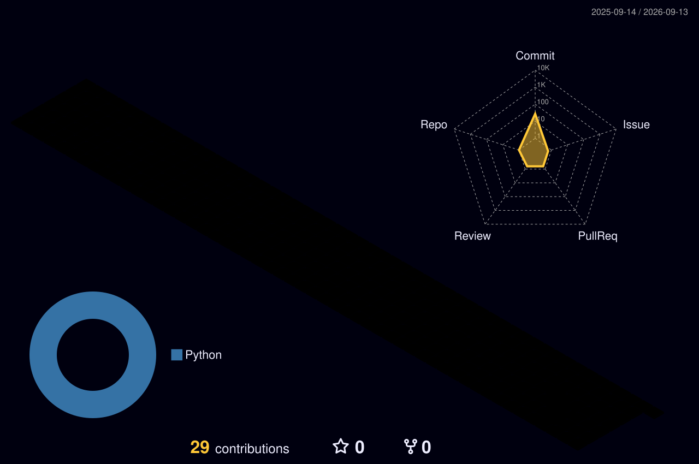

<a name="top"></a>

<div align="center">
  
</div>

<div align="center">
  
</div>

<div align="center">

  
  
  

</div>

<div align="center">

  <a href="#about"></a>
  <a href="#skills"></a>
  <a href="#stats"></a>
  <a href="#projects"></a>
  <a href="#contact"></a>

</div>

<div align="center">
  
</div>

<a name="about"></a>

##  &nbsp;01 — Về mình


Xin chào 👋 Mình là **Standardize Paradigm** — **học sinh lớp 7**, và mình học code vì nó vui thật sự.

Mọi thứ bắt đầu từ một dòng `print("Hello World")`. Rồi mình nhận ra: **học được 1 thứ sẽ mở ra 10 thứ muốn thử** — nên bây giờ mình vừa code, vừa tò mò **cực kỳ nhiều thứ khác** 🚀

```yaml
name:       Standardize Paradigm
role:       Học sinh lớp 7 • Lập trình viên tự học
learning:   [Python, JavaScript, Web, "và mọi thứ trông thú vị"]
superpower: Học nhanh + không sợ code lỗi
timezone:   UTC+7 (Việt Nam)
fun_fact:   Bug đầu tiên mình fix mất 3 tiếng — và mình vẫn nhớ nó
motto:      "Cứ thử đi, sai thì học được nhiều hơn"
```

- 🌱 &nbsp;**Đang học:** Python, JavaScript và tự làm web nho nhỏ
- 🛠️ &nbsp;**Đang xây:** game mini, tool tiện tay, vài project "để cho vui"
- 🎯 &nbsp;**Mục tiêu năm nay:** 3 project tử tế + code sạch hơn
- 💬 &nbsp;**Hỏi mình về:** Python, HTML/CSS, cách bắt đầu code khi còn đi học
- 🤝 &nbsp;**Muốn tìm:** bạn cùng tuổi để làm project chung
- ⚡ &nbsp;**Sự thật:** mình đọc tài liệu tiếng Anh dù đôi lúc phải tra từ điển

<br clear="both" />

> [!NOTE]
> Mình còn nhỏ, code còn nhiều chỗ chưa tối ưu — nếu bạn thấy gì cần sửa, mở issue chỉ mình với nhé. Mình thích được góp ý 🙌

---

### 🗺️ &nbsp;Lộ trình học của mình

<div align="center">

  
  &nbsp;➜&nbsp;
  
  &nbsp;➜&nbsp;
  

  <br />

  
  &nbsp;➜&nbsp;
  
  &nbsp;➜&nbsp;
  

</div>

<div align="center">

| Chặng | Mình học gì | Học được gì cụ thể | Trạng thái |
| :--: | :-- | :-- | :--: |
| `01` | 🧩 &nbsp;**Scratch** | Kéo thả logic, hiểu vòng lặp đầu tiên |  |
| `02` | 🐍 &nbsp;**Python** | Biến, if/else, list, dict, hàm |  |
| `03` | 🌐 &nbsp;**HTML + CSS** | Dựng layout, Flexbox, responsive |  |
| `04` | 🎮 &nbsp;**Pygame** | Sprite, va chạm, tính điểm |  |
| `05` | ⚡ &nbsp;**JavaScript** | DOM, event, web có tương tác |  |
| `06` | 🤖 &nbsp;**Chatbot + AI** | Gọi API, xứ lý câu hỏi đơn giản |  |
| `07` | ⚛️ &nbsp;**React** | Component, state, props |  |
| `08` | 🚀 &nbsp;**Full-stack** | Ghép tất cả thành 1 sản phẩm thật |  |

</div>

### ⏰ &nbsp;Một ngày của mình

<div align="center">

🏫🏫🏫🏫🏫🏫🏫💻💻💻💻📝📝📝🎨🎨📚📚😴😴

<sub>20 ô = 1 ngày &nbsp;•&nbsp; 🏫 trường &nbsp;•&nbsp; 💻 code &nbsp;•&nbsp; 📝 bài tập &nbsp;•&nbsp; 🎨 sở thích khác &nbsp;•&nbsp; 📚 đọc tài liệu &nbsp;•&nbsp; 😴 nghỉ</sub>

</div>

<div align="center">

| Mình làm gì | Thời lượng trong ngày | |
| :-- | :-- | --: |
| 🏫 &nbsp;**Học ở trường** | `███████░░░░░░░░░░░░░` | `35%` |
| 💻 &nbsp;**Code & làm project** | `████░░░░░░░░░░░░░░░░` | `20%` |
| 📝 &nbsp;**Làm bài tập** | `███░░░░░░░░░░░░░░░░░` | `15%` |
| 🎨 &nbsp;**Sở thích khác** | `██░░░░░░░░░░░░░░░░░░` | `12%` |
| 📚 &nbsp;**Đọc tài liệu / tutorial** | `██░░░░░░░░░░░░░░░░░░` | `10%` |
| 😴 &nbsp;**Nghỉ ngơi** | `██░░░░░░░░░░░░░░░░░░` | `8%` |

</div>

<div align="center">
  
</div>

<a name="skills"></a>

## 🧰 &nbsp;02 — Bộ công cụ của mình

<div align="center">


<br />


</div>

<div align="center">

| | |
| :-- | :-- |
| **💻 &nbsp;Ngôn ngữ** |     |
| **🌐 &nbsp;Web** |     |
| **🔧 &nbsp;Công cụ** |     |
| **🎨 &nbsp;Khác** |     |
| **🌱 &nbsp;Đang học** |     |

</div>

### 📈 &nbsp;Tiến độ kỹ năng

<div align="center">

| Kỹ năng | Tiến độ | Mục tiêu gần nhất |
| :-- | :-- | :-- |
| 🐍 &nbsp;**Python** | `████████░░` &nbsp;`80%` | Hoàn thiện 1 game Pygame |
| 🌐 &nbsp;**HTML / CSS** | `███████░░░` &nbsp;`70%` | Tự thiết kế portfolio |
| 🔧 &nbsp;**Git / GitHub** | `██████░░░░` &nbsp;`60%` | Làm quen pull request |
| ⚡ &nbsp;**JavaScript** | `█████░░░░░` &nbsp;`50%` | Web có tương tác thật |
| 🎮 &nbsp;**Pygame** | `████░░░░░░` &nbsp;`45%` | Thêm âm thanh + điểm cao |
| 🧠 &nbsp;**Thuật toán** | `████░░░░░░` &nbsp;`40%` | Giải 100 bài luyện tập |
| 🇬🇧 &nbsp;**Tiếng Anh IT** | `██████░░░░` &nbsp;`60%` | Đọc docs không cần dịch |
| 🤖 &nbsp;**AI / Chatbot** | `███░░░░░░░` &nbsp;`30%` | Viết chatbot đầu tiên |

</div>

> [!TIP]
> Mình cập nhật bảng này mỗi tháng. Học chậm cũng được, miễn là đừng dừng 🌟

### 🎯 &nbsp;Mục tiêu năm nay

- [x] Học xong Python cơ bản
- [x] Đẩy project đầu tiên lên GitHub
- [x] Biết dùng commit / branch cho tử tế
- [ ] Làm xong 1 game mini hoàn chỉnh 🎮
- [ ] Tự viết trang portfolio bằng HTML/CSS/JS 🌐
- [ ] Giải 100 bài luyện thuật toán 🧠
- [ ] Góp 1 pull request vào project open-source 🤝
- [ ] Viết chatbot đầu tiên bằng Python 🤖

<div align="right"><a href="#top">🔝 &nbsp;Về đầu trang</a></div>

<div align="center">
  
</div>

<a name="stats"></a>

## 📊 &nbsp;03 — Thống kê GitHub

<!--
  Hai thẻ dưới đây là file SVG nằm ngay trong repo này (assets/).
  GitHub Actions tự sinh lại chúng mỗi ngày bằng GITHUB_TOKEN của repo.
  → Không gọi server bên thứ ba nào → không bao giờ bị rate-limit / 503.
-->

<div align="center">

  
  

  <br />

  

</div>

### 🏙️ &nbsp;Biểu đồ contribution 3D

<div align="center">

  

  <sub>Tự cập nhật mỗi ngày — ảnh lưu ngay trong repo này</sub>

</div>

<div align="right"><a href="#top">🔝 &nbsp;Về đầu trang</a></div>

<div align="center">
  
</div>

<a name="projects"></a>

## 🚀 &nbsp;04 — Dự án mình tự hào

<div align="center">

  <a href="https://github.com/your-username/your-repo-1">
    
  </a>
  <a href="https://github.com/your-username/your-repo-2">
    
  </a>
  <a href="https://github.com/your-username?tab=repositories">
    
  </a>

</div>

<div align="center">

| Dự án | Mình làm gì | Công nghệ | Trạng thái |
| :-- | :-- | :-- | :--: |
| 🎮 &nbsp;**Mini Game** | Game 2D đầu tay, có tính điểm + âm thanh | `Python` `Pygame` |  |
| 🌐 &nbsp;**Portfolio Web** | Trang giới thiệu bản thân, responsive | `HTML` `CSS` `JS` |  |
| 🧰 &nbsp;**Study Tools** | Tool nhỏ giúp mình học và làm bài nhanh hơn | `Python` |  |
| 🤖 &nbsp;**Chatbot** | Bot trả lời câu hỏi đơn giản | `Python` |  |

</div>

<!-- Sửa 4 dòng trên thành project thật của bạn, hoặc xoá dòng chưa có -->

<details>
<summary><b>📚 &nbsp;Nhật ký học tập — mình học được gì gần đây</b></summary>

<br />

| Thời gian | Mình học được |
| :-- | :-- |
| Tháng này | Hàm, vòng lặp lồng nhau, và cách chia code thành file nhỏ |
| Tháng trước | Flexbox — cuối cùng cũng căn giữa được cái div 😂 |
| 3 tháng trước | Git: commit, branch, và cách sửa khi push sai |
| 6 tháng trước | Python cơ bản: biến, if/else, list, dict |

</details>

<details>
<summary><b>🖥️ &nbsp;Setup của mình</b></summary>

<br />

| | |
| :-- | :-- |
| 💻 &nbsp;**Máy** | Laptop của gia đình — đủ để học code |
| 🪟 &nbsp;**Hệ điều hành** | Windows (đang tập dùng Linux) |
| ⌨️ &nbsp;**Editor** | VS Code + theme tối |
| 🔤 &nbsp;**Font code** | Fira Code (có ligature nhìn rất xinh) |
| 🎧 &nbsp;**Nhạc khi code** | Lo-fi hoặc nhạc game |
| 🥤 &nbsp;**Nhiên liệu** | Nước cam + snack |

</details>

<div align="right"><a href="#top">🔝 &nbsp;Về đầu trang</a></div>

<div align="center">
  
</div>

## 🎨 &nbsp;Ngoài code, mình còn "cực kỳ nhiều thứ khác"

<div align="center">
  
</div>

<div align="center">

| | | |
| :--: | :--: | :--: |
| 🎮 <br /> **Game** <br /> <sub>chơi và mơ tự làm ra</sub> | 🎧 <br /> **Âm nhạc** <br /> <sub>playlist khi code</sub> | 🎨 <br /> **Vẽ & Design** <br /> <sub>pixel art, poster</sub> |
| 📚 <br /> **Đọc sách** <br /> <sub>khoa học & công nghệ</sub> | 🤖 <br /> **AI & Robot** <br /> <sub>tò mò cách nó hoạt động</sub> | 🧩 <br /> **Giải đố** <br /> <sub>Rubik, logic, câu đố</sub> |
| ⚽ <br /> **Thể thao** <br /> <sub>để rời màn hình</sub> | 🎬 <br /> **Làm video** <br /> <sub>edit cho vui</sub> | 🌏 <br /> **Ngoại ngữ** <br /> <sub>tiếng Anh mỗi ngày</sub> |
| 🔭 <br /> **Khoa học** <br /> <sub>vũ trụ & vật lý</sub> | 🍳 <br /> **Nấu ăn** <br /> <sub>mì gói nâng cao</sub> | 📸 <br /> **Chụp ảnh** <br /> <sub>bằng điện thoại</sub> |

</div>

<details>
<summary><b>🎁 &nbsp;Vài điều nhỏ về mình (bấm để mở)</b></summary>

<br />


- 🕐 &nbsp;Mình code nhiều nhất vào buổi tối, sau khi xong bài tập
- 🐛 &nbsp;Câu mình nói nhiều nhất: *"ơ, ban đầu nó chạy được mà?"*
- 💾 &nbsp;Mình từng mất cả bài code vì chưa biết dùng Git — giờ thì commit liên tục
- 🧠 &nbsp;Mình tin: **học đều mỗi ngày** thắng **học dồn một hôm**
- 🌟 &nbsp;Ước mơ: trở thành software engineer và làm ra thứ nhiều người dùng
- 📝 &nbsp;Mình ghi chú mọi thứ học được — vì 3 ngày sau chắc chắn sẽ quên

<br clear="both" />

</details>

<div align="center">
  
</div>

<a name="contact"></a>

## 🤝 &nbsp;05 — Kết nối với mình

<div align="center">

  
  
  
  
  

  <br /><br />

  <a href="https://github.com/standardizeparadigm">
    
  </a>
  <a href="mailto:standardizeparadigm@donuco.com">
    
  </a>
  <a href="https://discord.com/users/1523863764464697424">
    
  </a>
  <a href="https://www.facebook.com/your-profile">
    
  </a>
  <a href="https://www.youtube.com/@your-channel">
    
  </a>

  <br /><br />

  <a href="https://github.com/your-username/your-username/issues/new">
    
  </a>

  <br />
  <sub>Mình rất thích nói chuyện về code — cứ nhắn mình nhé 💙</sub>

</div>

---

<div align="center">

  ### ⭐ &nbsp;Thấy project nào hay thì cho mình 1 star nhé — động lực của mình đó!

  

  <br />

  
  
  

</div>

<div align="center">
  
</div>
